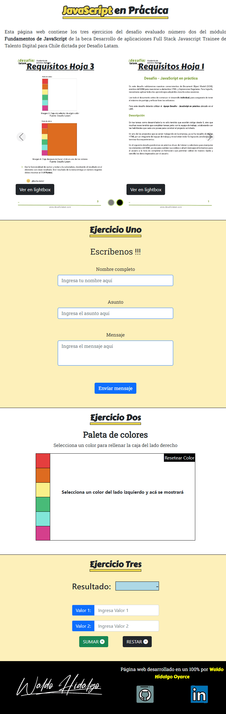
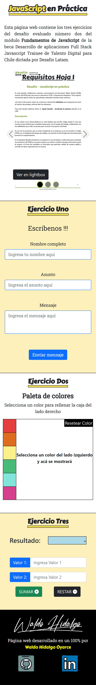

Este repositorio contiene el código con el cual he desarrollado el segundo desafío evaluado del módulo tres llamado **Fundamentos de programación en JavaScript** de la beca de Talento Digital para Chile Desarrollo de aplicaciones Full Stack Javascript Trainee V2.0 impartida por Desafío Latam. En mi proyecto he ido mucho más allá de los requisitos del proyecto con el propósito de practicar el conocimiento nuevo que voy adquiriendo. Las tecnologías que he utilizado son:

Mi proyecto en pantallas grandes lo muestro a continuación:

Mi proyecto en pantallas pequeñas lo muestro a continuación:

# Ejercicio 1

En los inputs del ejercicio uno he utilizado validación inmediata por medio de un escuchador de eventos sobre el evento del tipo input. He utilizado componentes de bootstrap 5 para estilizar los input y button presentes en el formulario. La validación de los input la realizo por medio del atributo llamado CustomError gatillado cuando utilizo **setCustomValidity** con argumento distinto de cadena vacía.

# Ejercicio 2

He estilizado de manera más llamativa el esqueleto original y además he agregado un botón para resetear el color del área de la derecha a blanco cuando se realiza click sobre el.

# Ejercicio 3

He utilizando input groups de bootstrap 5 y además he utilizado la validación inmediata de inputs por medio del escuchador de eventos sobre el evento input con el cual capturo lo ingresado para luego filtrarlo vía javascript y decidir si lo permito que se muestre o no.

# Elementos Adicionales

He implementado lo siguiente adicional:

-Carrusel con las imagenes de los requisitos para pantallas grandes y pequeñas. En pantallas grandes en cada item del carrusel se muestran 2 imagenes y en pantallas pequeñas en cada item solo se muestra una imagen

-Botones sobre cada imagen de los requisitos de modo que al hacer click sobre ellos se muestra la imagen en un lightbox

-En los inputs del ejercicio 3 para ingresar números, solo se permite el ingreso de números impidiendo el ingreso de caracteres que no son convertibles a número

-Botón para subir al top de la página
